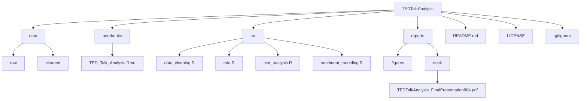

# Ted-Event-Performance-Trends
# TED Talk Analysis — Understanding Event Performance Trends

## 📌 Project Overview
This project is an **analytical deep dive into TED Talks**, aiming to uncover the factors that drive the success of talks and events.  
By combining **metadata, transcript analysis, sentiment analysis, and statistical modeling**, the study identifies the themes, audience reactions, and speaker attributes that contribute to TED Talks becoming “ideas worth spreading.”

**Business Question:**  
> What makes a TED Talk successful, and which factors influence audience engagement (views, comments, and ratings)?

---

## 🎯 Objectives
- Clean and preprocess TED Talk metadata and transcripts.
- Explore trends in views, comments, ratings, and languages.
- Identify **top-performing themes and ratings** that drive audience engagement.
- Perform **correlation analysis** between talk features and performance.
- Conduct **text analysis** on transcripts and speaker occupations.
- Run **sentiment analysis** to evaluate overall audience perception.
- Apply **statistical modeling (linear regression)** to validate findings.
- Provide insights to organizers on the best practices for future TED events.

---

## 🗃️ Dataset
- **Source:** [Kaggle TED Talks Dataset](https://www.kaggle.com/datasets/rounakbanik/ted-talks)  
- **Scope:** All TED Talks uploaded to TED.com through **Sept 21, 2017**.  
- **Tables used:**  
  - `ted_main` (metadata: speaker, date, views, comments, ratings, languages)  
  - `transcripts` (talk transcripts for NLP and sentiment analysis)  
- **Size:** 2,550 rows; 21 columns.  
- **Processing:**  
  - Cleaned in **R**.  
  - Added derived columns: *Average Comments*, *Average Views*, *Average Duration (minutes)*.  
  - Joined datasets on the `URL` column.

---

## 🧹 Data Cleaning
- Removed duplicate rows.  
- Handled missing values.  
- Standardized date/time fields.  
- Derived useful aggregates for statistical analysis.  

---

## 🔎 Analysis & Insights

### Temporal Patterns
- **Weekday Trends:** Certain weekdays consistently draw higher views (2010–2017).  
- **Best Month to Publish:** Seasonal analysis reveals months with better audience traction.  

### Audience Ratings
- **“Inspiring”** and **“Funny”** are the most frequent ratings.  
- Talks that **motivate** or **entertain** resonate deeply with audiences.  
- Key drivers: **Inspiration, humor, and impact**.  

### Themes & Topics
- TED Talks cover a broad spectrum, but **Technology, Science, and Global Issues** dominate engagement.  
- Emerging themes (e.g., art, humor, poverty) appear less frequently but contribute to diversity.  

### Correlations
- **Strong:** Film Date ↔ Published Date (0.9), Views ↔ Comments (0.53).  
- **Moderate:** Languages ↔ Views (0.38).  
- **Weak:** Duration ↔ Views (0.05).  
- **Key Insight:** Engagement (comments) and views are the strongest performance indicators.  

### Text Analysis
- **Transcript Word Cloud:** Large words = frequent terms; smaller terms like “art”, “humor”, “poverty” show niche but important topics.  
- **Occupation Word Cloud:** Prominent roles = Writer, Architect, Entrepreneur, Artist, Journalist. Specialized roles = Data Scientist, Marine Biologist, Activist.  
- TED’s impact lies in its **multi-disciplinary expertise**, blending creativity, science, and innovation.  

### Sentiment Analysis
- **Positive sentiments:** 155,893  
- **Negative sentiments:** 101,691  
- **Difference:** +54,202 → strong lean toward positivity.  
- ~40% of sentiments are still negative → signals improvement areas.  

### Statistical Modeling
- **Linear Regression** between predicted and actual sentiment scores shows a strong **positive correlation**.  
- Outliers highlight talks where the model predictions diverge significantly, suggesting unique factors at play.  

---

## 📌 Key Insights
1. **Engagement = Views + Comments.** These are the best indicators of TED Talk success.  
2. **Inspiration and Humor matter.** Talks that blend motivation with entertainment attract higher audience ratings.  
3. **Technology, Science, and Global Issues** dominate themes but diversity (art, activism) enriches the platform.  
4. **Positive sentiment dominates,** but persistent negative sentiment (~40%) signals improvement opportunities.  
5. **Speaker diversity** (occupations, disciplines) is key to TED’s global appeal.  
6. **Timing matters.** Publishing during certain months/days boosts engagement.  

---

## ✅ Recommendations
- **Emphasize inspiring and entertaining delivery** in future talks.  
- **Leverage multi-disciplinary expertise** by inviting more diverse professionals.  
- **Focus on technology and science** but keep space for underrepresented topics.  
- **Address negative audience sentiment** through improved moderation and feedback loops.  
- **Optimize event scheduling** by aligning with identified high-engagement periods.  

---

## 🛠️ Tools & Technologies
- **Language:** R  
- **Libraries:** tidyverse, ggplot2, dplyr, tm, tidytext, syuzhet, wordcloud, corrplot  
- **Modeling:** Linear regression for sentiment prediction.  
- **Visualization:** Word clouds, correlation plots, time series.  

---

## 📂 Repository Structure 

---
## 📜 License

- This project is licensed under the MIT License.
---
